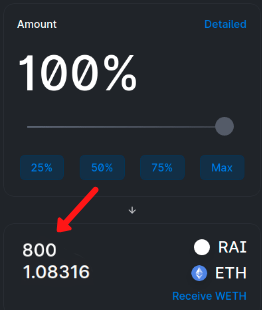

# RAI Uniswap V2 Mint + LP Incentives Program

## Overview

The RAI Mint + LP strategy requires that participants mint RAI **and** provide RAI/ETH liquidity on Uniswap v2 at the same time in order to accrue retroactive rewards.

## How It Works

1. Go to [app.reflexer.finance](https://app.reflexer.finance) or [DeFi Saver](https://app.defisaver.com/reflexer/manage) and mint some RAI.
2. Go to the [RAI/ETH Uniswap v2 pool](https://app.uniswap.org/#/add/v2/ETH/0x03ab458634910AaD20eF5f1C8ee96F1D6ac54919) and add the RAI you minted as liquidity

You do **not** accrue rewards if:

* You provide RAI/ETH liquidity without minting RAI (e.g buy from the pool and LP)
* You mint RAI without adding RAI/ETH liquidity

If you mint more RAI than the amount of RAI you provide as liquidity, you only accrue rewards on the amount you minted & LPed. Likewise, if you add more RAI as liquidity than you mint, you accrue rewards only on the RAI amount that you both minted and LPed.\
\
In short, you can think of mint + LP as a formula: `RAI Eligible for Rewards = min(RAI from LP token balance of an address`, `Total RAI debt from Safes owned by the address)`.

## Important Notes

* You **must** use the same address to mint RAI and provide Uniswap v2 RAI/ETH liquidity
* The Uniswap v2 RAI/ETH LP tokens **must** stay on the same address that you used to mint RAI and provide liquidity
* To see the minimum amount of RAI you must mint on mainnet, check the first [onboarding page in the app](https://app.reflexer.finance)
* If you open multiple Safes with the same address, your total RAI debt will be the sum of all RAI minted by each of your Safes
* If your Safe gets liquidated, the amount of minted RAI you have decreases by the amount of RAI that got confiscated
* If you would like to use a [Gnosis Safe](https://gnosis-safe.io) to manage your RAI positions and provide liquidity on Uniswap, you can connect to the Safe using WalletConnect and then use [app.reflexer.finance](https://app.reflexer.finance)

## Scenarios

#### 1. I already minted RAI but did not provide any liquidity

Go to the [Uniswap v2 RAI/ETH pool](https://app.uniswap.org/#/add/v2/ETH/0x03ab458634910AaD20eF5f1C8ee96F1D6ac54919) in order to provide liquidity. You should add less or the same amount of RAI you previously minted in the pool. If you provide more RAI as liquidity than the amount of RAI you minted, you only accrue rewards on the amount you both minted and LPed.

#### 2. I already added RAI/ETH liquidity but did not mint any RAI

You need to mint RAI in order to accrue rewards. To determine the maximum amount of RAI that you should mint, do the following:

* Go to the [Uniswap v2 RAI/ETH pool](https://app.uniswap.org/#/add/v2/ETH/0x03ab458634910AaD20eF5f1C8ee96F1D6ac54919) and check how much RAI you would get back if you were to withdraw all your liquidity. Take note of the amount.

* Go to [app.reflexer.finance](https://app.reflexer.finance) or [DeFi Saver](https://app.defisaver.com/reflexer/manage) and mint RAI up to the amount that you already provided in the pool.
* You’re now accruing rewards on the amount of RAI that you both minted and LPed.

#### 3. I minted more RAI than the amount of RAI I added as liquidity

Currently you’re only accruing rewards for the amount you both minted and LPed. If you would like to accrue more rewards, you need to add more RAI as liquidity in the [Uniswap v2 RAI/ETH pool](https://app.uniswap.org/#/add/v2/ETH/0x03ab458634910AaD20eF5f1C8ee96F1D6ac54919).

**4. I minted less RAI than I can currently claim from the Uniswap v2 pool**

Similar to the second scenario, if you would like to be eligible for more rewards, you need to check the amount of RAI that you can currently withdraw from the RAI/ETH pool and determine how much more RAI you need to mint.

## Questions

#### If I provide X RAI as liquidity in the RAI/ETH Uniswap v2 pool, I might not get the same amount of RAI back when I withdraw liquidity later on. What should I do?

The retroactive scripts take this situation into account. You do not need to do anything.
